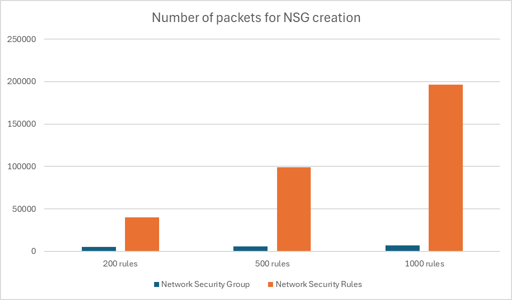

# Terraform and Bicep scripts to benchmark NSG deployment in Azure

# Overview

Terraform and Bicep scripts deploy a network security group (NSG) in Azure and to benchmark multiple options. 

On Terraform, one script is using only [azurerm_network_security_group](https://registry.terraform.io/providers/hashicorp/azurerm/latest/docs/resources/network_security_group) resource and the other script is using azurerm_network_security_group and [azurerm_network_security_rule](https://registry.terraform.io/providers/hashicorp/azurerm/latest/docs/resources/network_security_rule) resource to create the same NSG.

On Bicep, one script is using only [networkSecurityGroup](https://docs.microsoft.com/en-us/azure/templates/microsoft.network/2021-02-01/networksecuritygroups) resource and the other script is using networkSecurityGroup and [securityRules](https://docs.microsoft.com/en-us/azure/templates/microsoft.network/2021-02-01/networksecuritygroups/securityrules) resource to create the same NSG.

This repository will use GitHub Actions to benchmark the deployment time of the scripts.

# Usage

Any user can clone this repository and run the GitHub Actions workflow to benchmark the deployment time of the scripts.

The action is triggered by a push to the main branch if change is dedected on corresponding folder : terraform or bicep. The action will deploy the two scripts in parallel.

# Benchmark

* **Test 1** : NSG creation with 200 rules (Plan / Apply / Destroy)  
* T**est 2** : NSG creation with 500 rules (Plan / Apply / Destroy)  
* **Test 3** : NSG creation with 1000 rules (Plan / Apply / Destroy)  
* **Test 4** : NSG creation with 2 rules (Plan / Apply)  
* **Test 5** : NSG update from 2 rules to 200 rules (Plan / Apply)  
* **Test 6** : NSG update from 200 rules to 500 rules (Plan / Apply)  
* **Test 7** : NSG update from 500 rules to 1000 rules (Plan / Apply)  


```Remark : in Bicep script, plan is provide using what-if command and apply using deployment create command. With a subscription scope, the destroy is not possible. The cleanup is done by deleting the resource group.```

# Results

The results are in seconds. The results are the smallest value of multiple runs.  
x = test failed after multiple runs.

## Creation from scratch

| Test  | Action  | Terraform - Security Group | Terraform - Security Rule | Bicep - Security Group | Bicep - Security Rule |
|---|---|---:|---:|---:|---:|
| NSG with 200 rules  | Plan  | 6  | 6  | 24  | 40  |
| NSG with 200 rules  | Apply  | 24  | 110  | 43 | 600 |
| NSG with 200 rules  | Destroy  | 126  | 319  | 126 | 148 |
|||||||
| NSG with 500 rules  | Plan  | 8  | 8  | 21 | 83 |
| NSG with 500 rules  | Apply  | 42  | 218  | 42 | x |
| NSG with 500 rules  | Destroy  | 77  | 703  | 128 | x |
|||||||
| NSG with 1000 rules  | Plan  | 17  | 14  | 22 | x |
| NSG with 1000 rules  | Apply  | 95  | 541  | 46 | x |
| NSG with 1000 rules  | Destroy  | 119  | 1631  | 127 | x |


I have remove from the graph the destroy, Bicep is not able to destroy the resource directly. Cleanup is done by deleting the resource group.

## Update

| Test  | Action  | Terraform - Security Group | Terraform - Security Rule | Bicep - Security Group | Bicep - Security Rule |
|---|---|---:|---:|---:|---:|
| NSG with 2 rules  | Plan  | 3  | 5  | 21 | 23 |
| NSG with 2 rules  | Apply  | 20  | 21  | 42 | 78 |
|||||||
| Update from 2 rules to 200 rules  | Plan  | 6  | 5  | 21 | 52 |
| Update from 2 rules to 200 rules  | Apply  | 15  | 87  | 43 | 141 |
|||||||
| Update from 200 rules to 500 rules  | Plan  | 14  | 22  | 21 | 176 |
| Update from 200 rules to 500 rules  | Apply  | 38  | 173  | 43 | 391 |
|||||||
| Update from 500 rules to 1000 rules  | Plan  | 36  | 88  | 22 | 21 |
| Update from 500 rules to 1000 rules  | Apply  | 107  | 400  | 43 | x |


## Comparisons

### Security Group vs Security Rule

On Terraform, if we compare the ratio between the two methods, we can see that security_group is around 5 times faster than security_rule on ceation and 4 times faster on update.


On Bicep, ...

Managing NSG with security group is faster than managing NSG with security rule. The difference is more significant for NSG with high number of rules.

### Terraform vs Bicep

If we focus on security group option, Terraform is faster than Bicep for small number of rules (until 500 rules). For large number of rules, Bicep is faster than Terraform.

Security rules option with Terraform or Bicep provide bad performance in particular for large number of rules. As Bicep is generated one ARM deployment for each rule, I was not able to test the creation of NSG with high number of rules because at least one deployment failed.

## Network traffic

In addition of those tests, I have performed some network captures to measure the network traffic generated by the two methods in Terraform.
I have measure the number of packets between my computer and the Azure for the creation of the NSG.

|   | NSG with 200 rules |  NSG with 500 rules | NSG with 1000 rules |
|---|---:|---:|---:|
| Network Security Group |  5371 | 6023 | 6963 |
| Network Security Rule |  39987 | 99349 | 196261 |



This result is not surprising. The network_security_rule resource is creating one rule at a time generating one API call. This is generating a lot of network traffic. On the other hand, the network_security_group resource is creating all the rules at once so less network traffic.

# Conclusion

In Terraform or in Bicep, working on security group resource is faster than the security rule resource. The difference is more significant when creating or updating a large number of rules.

Terraform seems to be faster for small number (1-500) of rules and Bicep for large number of rules (500-1000).

The behavior of the two ressources to manage NSG is not the same. Working on  security group level will remove any rule not defined in the script. The security rule level will only manage the rules defined in the script (additional rules can be managed on another script or using the portal).
