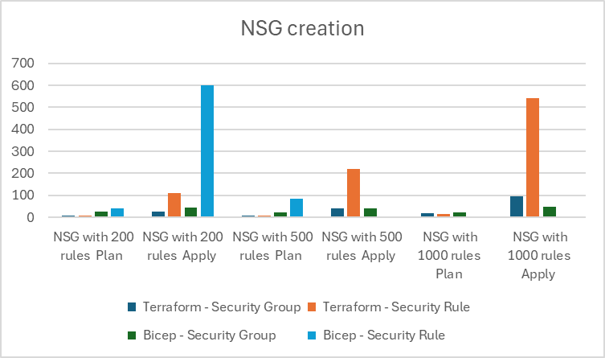

# Terraform script to benchmark NSG deployment in Azure

# Overview

This Terraform script deploys a network security group (NSG) in Azure. 

One script is using only [azurerm_network_security_group](https://registry.terraform.io/providers/hashicorp/azurerm/latest/docs/resources/network_security_group) resource and the other script is using azurerm_network_security_group and [azurerm_network_security_rule](https://registry.terraform.io/providers/hashicorp/azurerm/latest/docs/resources/network_security_rule) resource to create the same NSG.

This repository will use GitHub Actions to benchmark the deployment time of the two scripts.

# Usage

Any user can clone this repository and run the GitHub Actions workflow to benchmark the deployment time of the two scripts.

The action is triggered by a push to the main branch. The action will deploy the two scripts in parallel.

# Benchmark

* **Test 1** : NSG creation with 200 rules (Plan / Apply / Destroy)  
* T**est 2** : NSG creation with 500 rules (Plan / Apply / Destroy)  
* **Test 3** : NSG creation with 1000 rules (Plan / Apply / Destroy)  
* **Test 4** : NSG creation with 2 rules (Plan / Apply)  
* **Test 5** : NSG update from 2 rules to 200 rules (Plan / Apply)  
* **Test 6** : NSG update from 200 rules to 500 rules (Plan / Apply)  
* **Test 7** : NSG update from 500 rules to 1000 rules (Plan / Apply)  

# Results

The results are in seconds. The results are the smallest value of 2 runs (very little difference between the two runs).

## Creation from scratch

| Test  | Action  | Benchmark Network Security Group | Benchmark Network Security Rule |
|---|---|---:|---:|
| NSG creation with 200 rules  | Plan  | 6  | 6  |
| NSG creation with 200 rules  | Apply  | 24  | 110  |
| NSG creation with 200 rules  | Destroy  | 126  | 319  |
|||||
| NSG creation with 500 rules  | Plan  | 8  | 8  |
| NSG creation with 500 rules  | Apply  | 42  | 218  |
| NSG creation with 500 rules  | Destroy  | 77  | 703  |
|||||
| NSG creation with 1000 rules  | Plan  | 17  | 14  |
| NSG creation with 1000 rules  | Apply  | 95  | 541  |
| NSG creation with 1000 rules  | Destroy  | 119  | 1631  |

## Update

| Test  | Action  | Benchmark Network Security Group | Benchmark Network Security Rule |
|---|---|---:|---:|
| NSG creation with 2 rules  | Plan  | 3  | 5  |
| NSG creation with 2 rules  | Apply  | 20  | 21  |
|||||
| NSG update from 2 rules to 200 rules  | Plan  | 6  | 5  |
| NSG update from 2 rules to 200 rules  | Apply  | 15  | 87  |
|||||
| NSG update from 200 rules to 500 rules  | Plan  | 14  | 22  |
| NSG update from 200 rules to 500 rules  | Apply  | 38  | 173  |
|||||
| NSG update from 500 rules to 1000 rules  | Plan  | 36  | 88  |
| NSG update from 500 rules to 1000 rules  | Apply  | 107  | 400  |

## Comparison
If we compare the ratio between the two methods, we can see that security_group is around 5 times faster than security_rule on ceation and 4 times faster on update.

# Conclusion

Using network_security_group resource is faster than the network_security_rule resource. The difference is more significant when creating, updating or deleting a large number of rules.

The behavior of the two ressources to manage NSG is not the same. The network_security_group resource will remove any rule not defined in the Terraform script. The network_security_rule resource will only manage the rules defined in the Terraform script (additional rules can be managed on another script or using the portal).
